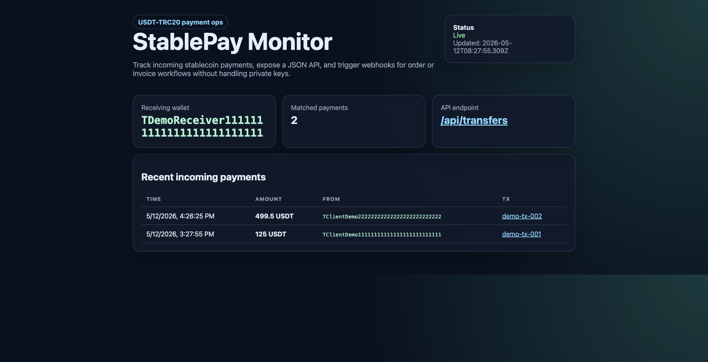

# StablePay TRON Monitor

A USDT-TRC20 payment monitor starter for freelancers, small merchants, and Web3 teams.
It watches a public TRON receiving address, displays incoming payments, exposes a JSON API, and can send webhook notifications when a new payment arrives.

## Why this exists

Many small Web3 businesses accept USDT but still reconcile payments manually in Telegram, spreadsheets, or exchange screenshots. This repo is a compact but production-shaped starting point for:

- USDT invoice confirmation
- Merchant dashboards
- Telegram/Discord payment alerts
- Subscription or order fulfillment webhooks
- Freelance escrow/payment proof workflows

## Features

- Watches USDT-TRC20 transfers to a public TRON address
- No private key required
- Dashboard at `/`
- JSON API at `/api/transfers`
- Health check at `/health`
- Optional webhook for new payment events
- In-memory de-duplication by transaction id
- Docker and docker-compose examples
- Zero runtime dependencies; works on Node.js 16+

## Quick start

```bash
cp .env.example .env
# edit TRON_ADDRESS in .env
set -a && . ./.env && set +a
npm start
```

Open `http://localhost:8787`.

Demo mode uses sample data:

```bash
npm run demo
```

## Demo screenshot



## Docker

```bash
DEMO_MODE=1 docker compose up --build
```

For a real wallet:

```bash
TRON_ADDRESS=TXXXXXXXXXXXXXXXXXXXXXXXXXXXXXX DEMO_MODE=0 docker compose up --build
```

## Configuration

```bash
TRON_ADDRESS=TXXXXXXXXXXXXXXXXXXXXXXXXXXXXXX
PORT=8787
POLL_SECONDS=30
FETCH_LIMIT=50
TRONGRID_API_KEY=
WEBHOOK_URL=
MIN_AMOUNT=0
DEMO_MODE=0
```

Only use a public receiving address. Never put a wallet private key, seed phrase, exchange password, or withdrawal API key in this app.

## Project structure

```text
src/config.js       environment parsing and validation
src/dashboard.js    server-rendered dashboard UI
src/demoData.js     deterministic demo transfers
src/filter.js       payment normalization and matching
src/server.js       HTTP routes and polling loop
src/store.js        in-memory cache and de-duplication
src/tronGrid.js     TRONGrid API adapter
src/webhook.js      outbound webhook sender
```

## Webhook payload

```json
{
  "txid": "...",
  "from": "T...",
  "to": "T...",
  "contract": "TXLAQ63Xg1NAzckPwKHvzw7CSEmLMEqcdj",
  "symbol": "USDT",
  "amount": "125.5",
  "rawAmount": "125500000",
  "timestamp": 1710000000000,
  "confirmed": true,
  "matchesReceiver": true,
  "explorerUrl": "https://tronscan.org/#/transaction/..."
}
```

A local webhook receiver is available for testing:

```bash
node examples/webhook-receiver.js
WEBHOOK_URL=http://localhost:9090 npm run demo
```

## Docs

- `docs/API.md` - API and webhook reference
- `docs/CLIENT_HANDOFF.md` - client delivery checklist
- `docs/ROADMAP.md` - paid extension paths

## Commercial extensions

This starter can be extended into paid client work:

- invoice generation with unique payment amounts
- Telegram/Discord notifications
- admin login and team roles
- order reconciliation against a database
- multi-chain support for USDC/USDT on Base, Polygon, Arbitrum, Solana, Ethereum, and TRON
- Stripe plus crypto hybrid checkout
- accounting exports

## License

MIT
